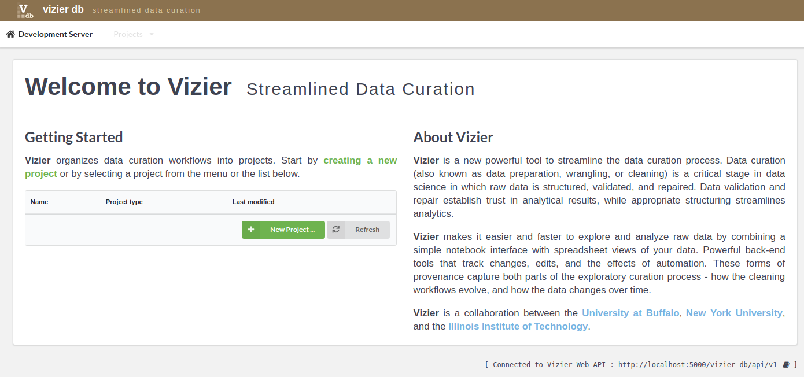
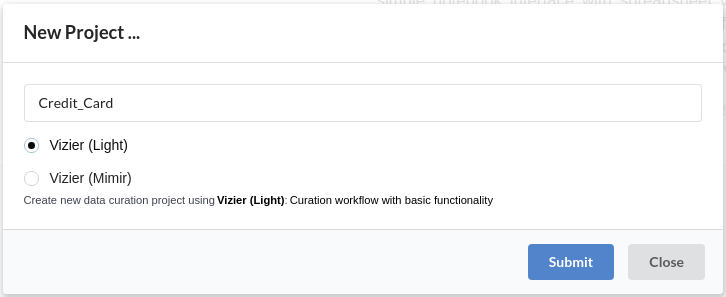
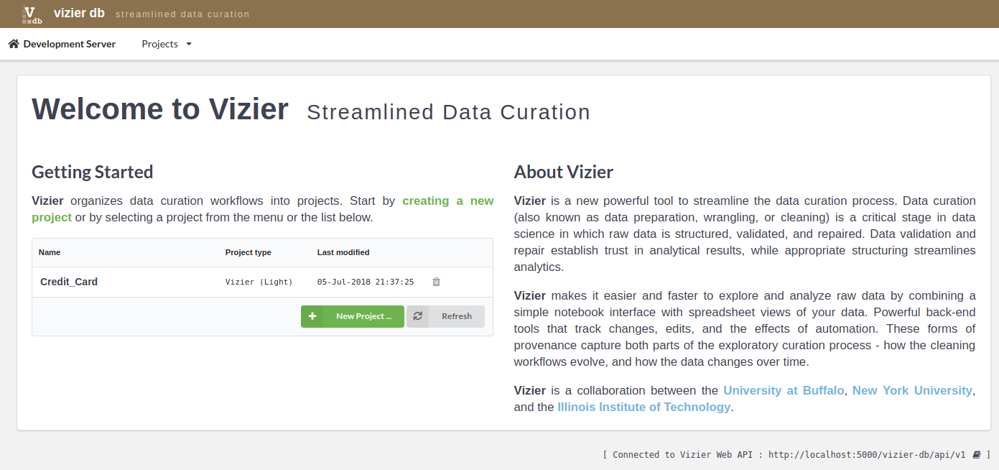

Create Project
-------------

Begin by adding a project on the Vizier page (initial page), shown in the figure above, by clicking on the **New Projects ...** button.

On the New Project... dialog shown in figure above, enter the name of the project you would like to create, for example **credit_card**, and click on **Submit** button. You should now see the new project you added in the list of projects as shown below.

Once project is added click on project name in the list of projects to data curation.
