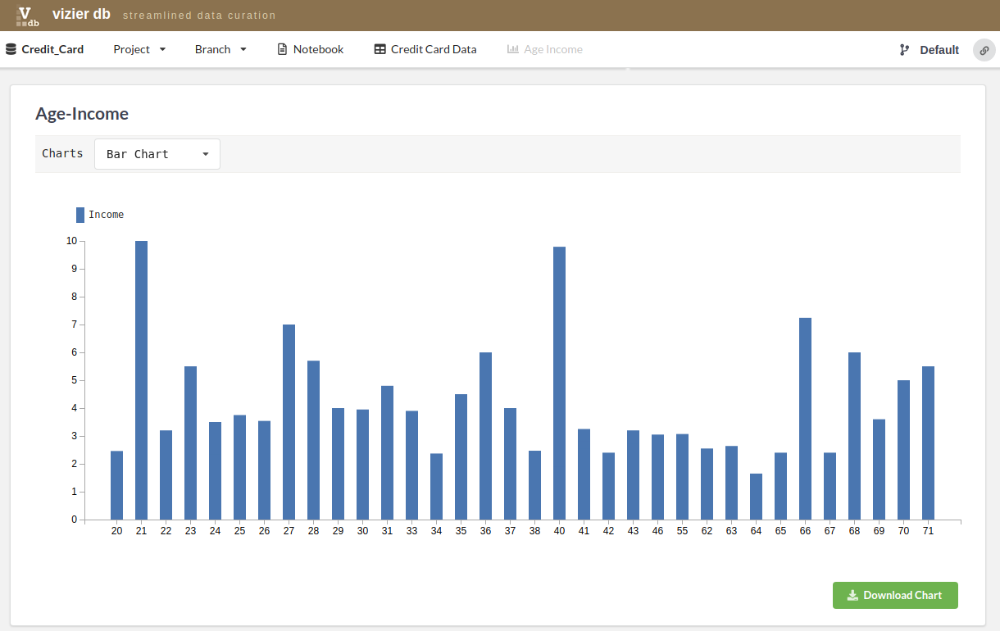

Chart Views
-------------

Vizier provides five types of chart: Simple bar chart, group bar chart, line chart, area chart and scatter plot.
To create a chart, user have to select a module **Plot>>Simple Chart** from the list below.

Then, fill the form and click on the blue **play** icon.

To access the Chart view of our Credit Card project just go under the **Age Income** Tab which is the name of the chart.

