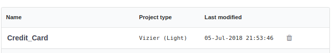
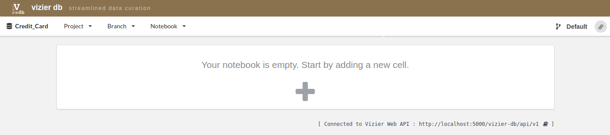
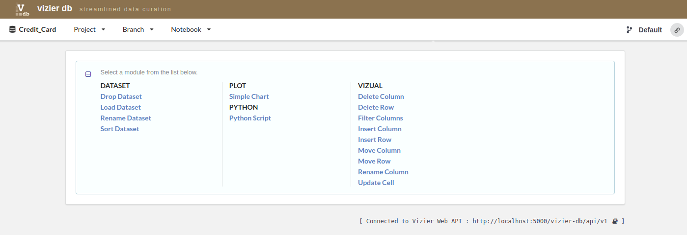

Load Dataset
-------------

Continuing with our example of the **Credit_Card** project, we show here the methods of uploading data.

First, select one project from the list of projects, for example, **credit_card** project by clicking on the name project.

Once you are inside the project, load the data by clicking in the sign **+**.

Then, go to the column **DATASET**, and click on **Load Dataset**

Then, upload the data set. You have to provide the data set name and the source file.

 .. image:: figures/load_data_2.png
    :width: 750px
    :align: center
    :height: 350px
    :alt: alternate text

For example, we entered **credit card data** as the name of the dataset for that project and selected ccard.csv dataset, then, click on the blue **play** icon.

 .. image:: figures/load_data_3.png
    :width: 750px
    :align: center
    :height: 300px
    :alt: alternate text

After loading the **credit card dataset**, we can start to explore and curate our data.

   .. image:: figures/load_data_4.png
     :width: 750px
     :align: center
     :height: 300px
     :alt: alternate text
