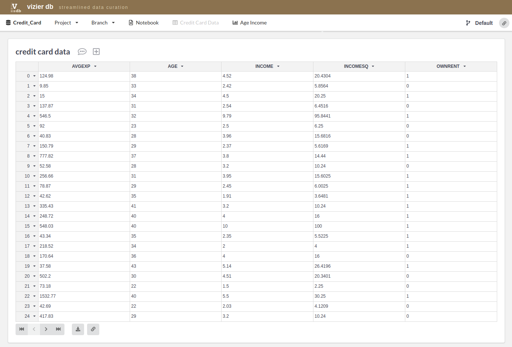

Spreadsheet Views
-------------

Vizier makes it easier and faster to explore and analyze raw data by combining a simple notebook interface with spreadsheet views of your data. Powerful back-end tools that track changes, edits, and the effects of automation. These forms of provenance capture both parts of the exploratory curation process - how the cleaning workflows evolve, and how the data changes over time.
To access the spreadsheet of our Credit Card project just go under the **Credit Card Data** Tab.

