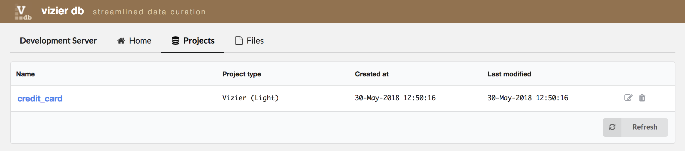
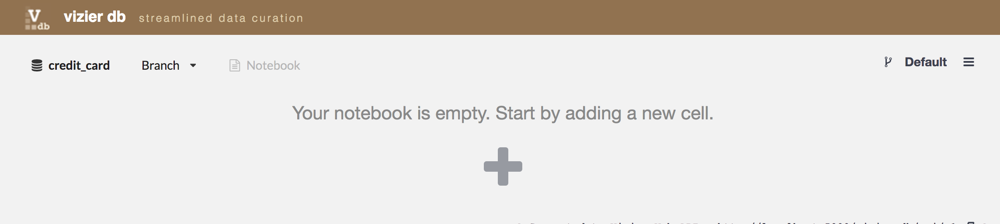
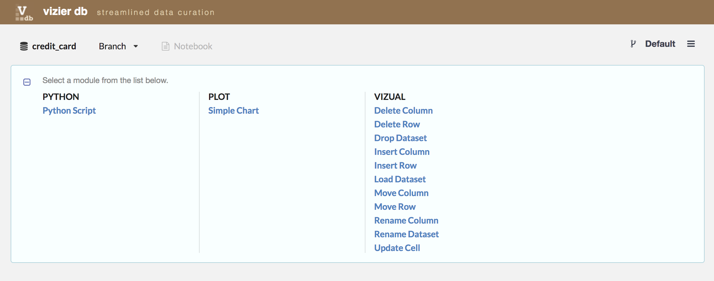
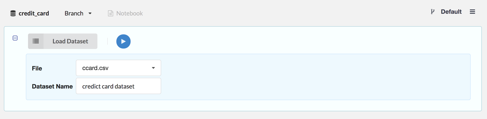
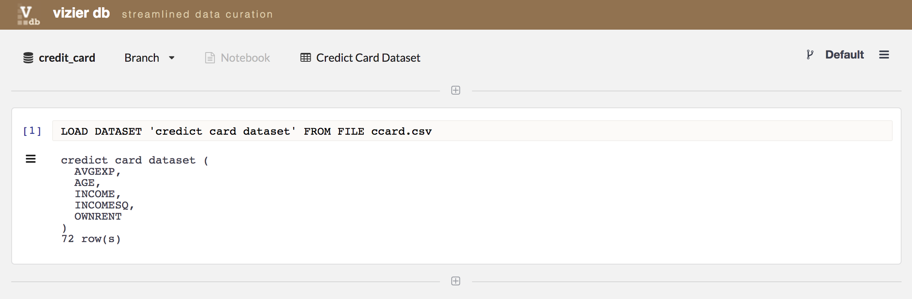

Loading Dataset in Project
-------------

First, go to the **Project** tab. There, you will be able to see the list of projects. Select one, for example, **credict_card** project by clicking on the name project.

Once you are inside the project, load the data by clicking in the sign **+**.

Then, go to the column **VIZUAL**, and click on **Load Dataset**

Then, select a dataset listed in **File** ComboBox. For example, we selected ccard.csv dataset and entered **credict card dataset** as the name of the dataset for that project, then, click on the blue **play** icon.

After loading the **credict card dataset**, we can start to explore and curate our data.

